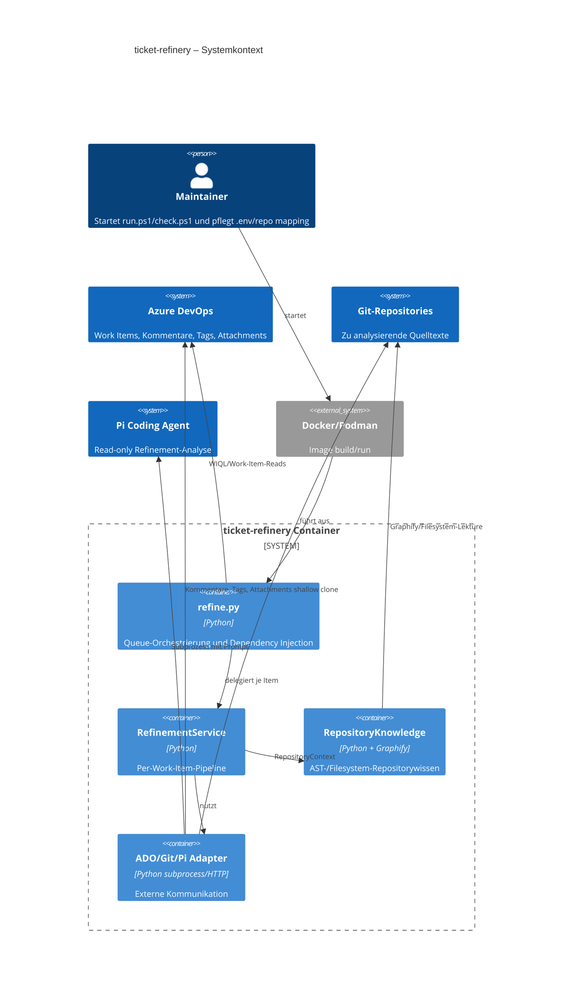
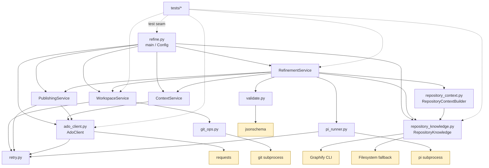
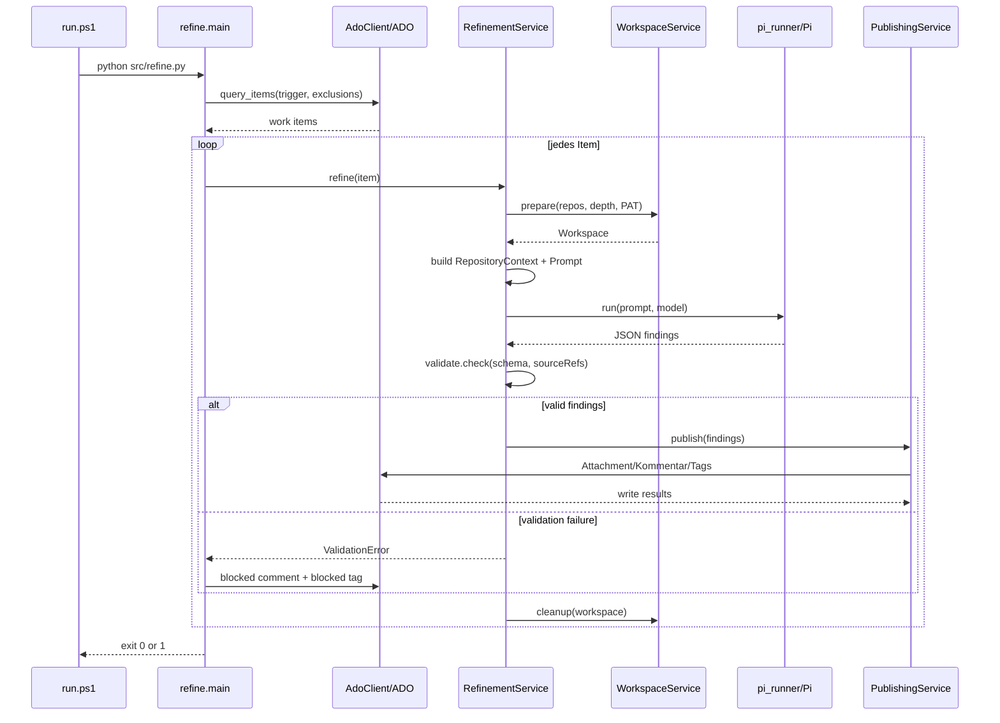
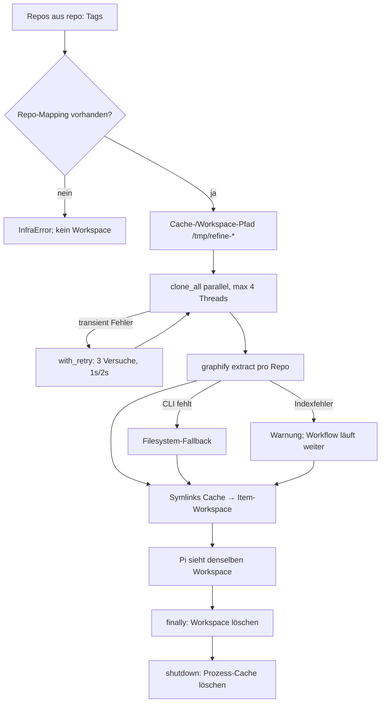
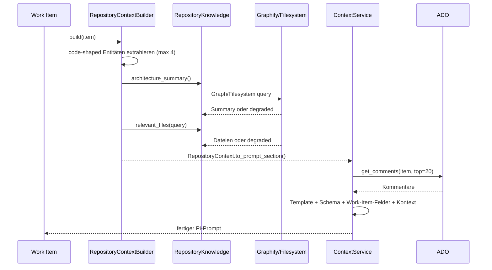
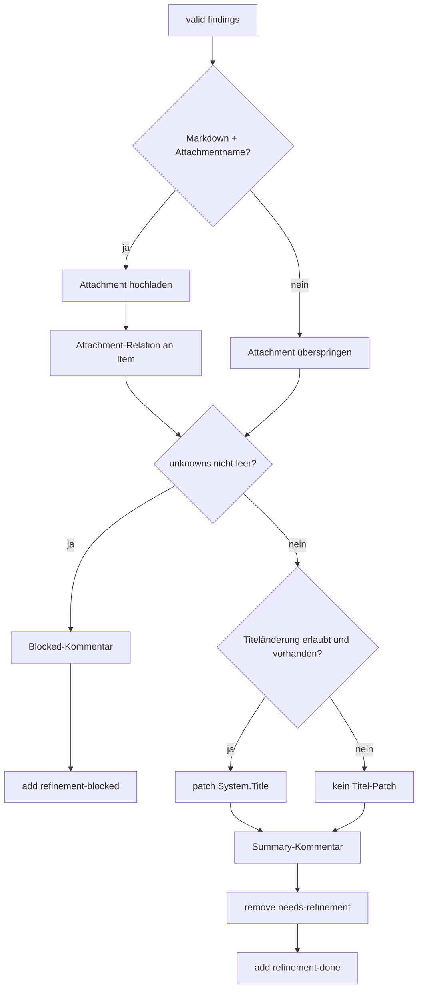
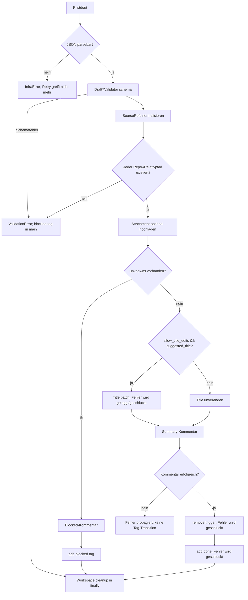

# Architektur- und Codeanalyse: ticket-refinery

**Analysezeitpunkt:** 2026-07-24 10:37:10 UTC  
**Scope:** `src/`, `tests/`, `Dockerfile`, `requirements.txt`, `run.ps1`, `check.ps1`, `README.md`, `.codegraph/codegraph.db`  
**Methode:** Quelltext- und AST-Lektüre, Python-AST-Import-/Komplexitätsauswertung, vorhandener CodeGraph, Testinventar. Mermaid-Diagramme sind aus den beobachteten Schnittstellen abgeleitet.

## 1. Executive Summary

`ticket-refinery` ist eine lineare, containerisierte Pipeline: Azure-DevOps-Queue lesen, Repositories klonen und indizieren, Kontext für Pi erzeugen, Findings validieren und nach ADO publizieren. Die Architektur trennt Orchestrierung (`refine.py`), per-Item-Workflow (`RefinementService`), Infrastrukturadapter und Rendering überwiegend sauber; der CodeGraph bestätigt eine gerichtete Abhängigkeit ohne zyklische Python-Modulkomponente. Die größten Betriebsrisiken liegen in partiellen ADO-Schreibvorgängen, doppelten Attachments bei Retry nach Relation-Fehlern, ungeschützter Pfadprüfung für LLM-gelieferte `sourceRef` sowie nicht reproduzierbaren Dependency-/Base-Image-Versionen. Die Tests decken die meisten lokalen Branches und Adapterverträge ab, aber keinen echten End-to-End-Lauf gegen Container, Graphify, Pi und ADO; ausführbare Coverage konnte in dieser Umgebung mangels funktionierendem Python-Test-Interpreter nicht erhoben werden.

## 2. Architekturübersicht

### Systemgrenzen und Container

### Bausteine und Schnittstellen

| Modul/Komponente | Öffentliche Oberfläche | Verantwortung | Abhängigkeiten |
|---|---|---|---|
| `src/refine.py` | `main`, `Config`, `process_item`, `render_prompt`, `extract_repo_tags`, `resolve_repos` | Env-Konfiguration, Queue-Schleife, Service-Komposition, Exitcodes | `AdoClient`, Services, `pi_runner`, `validate`, `RepositoryKnowledge` |
| `services.refinement_service` | `RefinementService.refine` | Per-Item-Reihenfolge und Fehlerzählung | alle drei Services, `pi_runner`, `validate`, `RepositoryContextBuilder` |
| `services.workspace_service` | `Workspace`, `prepare`, `cleanup`, `shutdown` | Clone-Cache, Symlinks, Graphify-Index, Cleanup | `git_ops`, `retry`, `subprocess` |
| `services.context_service` | `load_comments`, `build_inputs`, `render_prompt` | ADO-Kommentare + Template + Schema + RepositoryContext | `AdoClient`, Dateien |
| `services.publishing_service` | `publish`, Renderer | Attachment, Kommentar, Tags, optionaler Titel | `AdoClient`, `retry` |
| `ado_client` | `AdoClient` REST-Methoden | WIQL, Reads/Writes, Comments, Attachments, JSON Patch | `requests`, `retry` |
| `git_ops` | `clone_all`, `cleanup` | parallele shallow clones und kurzlebiger PAT-Header | stdlib `subprocess`, `ThreadPoolExecutor` |
| `pi_runner` | `run`, `InfraError` | Pi-CLI, Timeout, JSON-Parsing, Retry | stdlib, `retry` |
| `validate` | `check`, `_ref_resolves` | JSON-Schema plus `sourceRef`-Existenz | `jsonschema`, stdlib |
| `repository_knowledge` | `RepositoryKnowledge`, `KnowledgeBackend`, `GraphifyBackend`, `FilesystemBackend`, `make_knowledge` | Backend-Abstraktion für AST/Textsuche | Graphify CLI oder Filesystem |
| `repository_context` | `RepositoryContext`, `RepositoryContextBuilder` | Entitäten extrahieren, Architektur/relevante Dateien sicher laden | `repository_knowledge` |
| `retry` | `with_retry` | zentrale 3-Versuche-/Backoff-Policy | stdlib |
| `metrics` | `MetricsCollector`, `MetricsSnapshot` | In-Process-Counter und Timer | stdlib |

### Entry Points und APIs

- **Produktions-Entry-Point:** `run.ps1` → Container Engine → `python -u src/refine.py`.
- **Diagnose-Entry-Point:** `check.ps1`; prüft `.env`, Pflichtwerte, Repo-Mapping, Container Engine, Pi-Auth und optional ADO-Konnektivität.
- **Python-Entry-Point:** `src/refine.py:main`; Exit `0` bei leerer Queue oder erfolgreich blockierten Items, `1` bei Infrastrukturfehlern.
- **Framework-freie Self-Checks:** mehrere Module besitzen `if __name__ == "__main__"`-Checks; `git_ops.py` erwartet dagegen ein erreichbares Git-Repository als Argument.
- **Interne Schnittstellen:** `WorkspaceService`, `ContextService`, `PublishingService` werden per Konstruktor injiziert; `KnowledgeBackend` ist die zentrale Repositorywissen-Policy; `with_retry` ist der Retry-Seam.
- **Backwards-Compatibility-Seams:** `refine.process_item`, `refine.render_prompt`, `_link_repo_cache` und Legacy-Aliase in `repository_knowledge.py` halten ältere Tests/Imports am Leben.

## 3. CodeGraph und Strukturanalyse

Der vorhandene `.codegraph/codegraph.db` enthält **29 Dateien, 734 Knoten, 1.644 Kanten und 1.060 unresolved references**; Indexversion `1.1.3`, Extraction-Version `24`. Die unresolved references sind ein Hinweis auf begrenzte Auflösung externer/attributbasierter Symbole, kein Beleg für Laufzeitfehler.

### Modulabhängigkeiten

### Zyklen, Kopplung und Hotspots

- **Zyklen:** AST-Importanalyse über `src/**/*.py` fand keinen starken Zusammenhang größer 1. Die beabsichtigte Richtung ist `refine → services → leaf adapters/cross-cutting`.
- **Höchste strukturelle Komplexität:** `repository_knowledge.py` mit 132 AST-Bedingungs-/Schleifen-/Try-/BoolOp-Knoten; dort liegen Graph-JSON-Normalisierung, Graph-Traversierung, CLI-Verhalten und Filesystem-Fallback in einer Datei.
- **Hohe Kopplung:** `RefinementService` kennt Ablauf, DTO-Vertrag, Metrics-Namen, Schema-Pfad und Publikationsparameter. Das ist als Composer vertretbar, aber der zentrale Change-Hotspot.
- **Testkopplung:** Mehrere Tests patchen Modulattribute (`refine.git_ops`, `refine.validate`); das erklärt die Modulimports mit `# noqa` und erschwert spätere Umbenennungen.
- **Verdeckte Kopplung:** `RefinementService._record_duration` schreibt direkt in `MetricsCollector._timings_ms`; der Metrics-Typ ist dadurch kein vollständig gekapselter Port.

### Externe und interne Abhängigkeiten

| Abhängigkeit | Quelle/Version | Risiko |
|---|---|---|
| `requests` | `requirements.txt`, `>=2.31` | nicht reproduzierbarer Minor-/Major-Upgrade innerhalb der erlaubten Range; transitive Abhängigkeiten ungepinnt |
| `jsonschema` | `>=4.20` | API-/Validatoränderungen und transitive Drift |
| `graphifyy` | `>=0.9,<1.0` | CLI-/Graph-JSON-Schema kann sich innerhalb 0.x ändern; Runtime-Fallback degradiert still |
| Pi Coding Agent | Docker `PI_VERSION=0.80.3` | festgelegt, aber externes CLI-/JSON-Verhalten ist ein harter Laufzeitvertrag |
| Node Base Image | `node:24-bookworm-slim` | Tag ist beweglich; OS-Pakete und CVEs ändern sich ohne Quelländerung |
| `uv` Installer | `curl ... install.sh` ohne Digest/Version | Supply-chain- und Reproduzierbarkeitsrisiko |
| ADO REST | API-Version `7.1`, Preview-Kommentare `7.1-preview.4` | API-/Preview-Kompatibilität und Rate Limits |
| Git/Graphify/Pi | PATH im Container | fehlende Tools werden erst zur Laufzeit erkannt |
| interne Libraries | Python-Module unter `src/` | keine Paketmetadaten, kein Lockfile, Importpfad über Arbeitsverzeichnis |

## 4. Workflow-Analyse

### Workflow A: Queue-Polling und Per-Item-Verarbeitung

**Input:** ADO-Tags und Work-Item-Felder. **Output:** ADO-Kommentar, Attachment und Status-Tag oder Infrastrukturfehler. Die Queue wird einmal gelesen; neue Items während des Laufs werden erst beim nächsten Containerlauf erfasst.

### Workflow B: Workspace, Cache und Graphify

### Workflow C: Repository-Kontext vor Pi

### Workflow D: Publishing und Statusübergänge

## 5. Logik, Bedingungen und Fehlerpfade

### Komplexe Bedingungen

1. **`RefinementService.refine`**: Repo-Auflösung → Workspace → Kontext → Pi → Schema-/Pfadvalidierung → Publishing; `InfraError` wird gezählt und propagiert, alle anderen Exceptions werden als blocked gezählt und propagiert, Cleanup läuft in `finally`.
2. **`PublishingService.publish`**: Attachment optional; danach `unknowns` als fachlicher Blocker versus Done-Pfad.
3. **`PublishingService._publish_done`**: optionaler Titel-Patch, Kommentar als notwendiger Vorläufer der Tag-Transition, einzelne nachgelagerte Writes sind `_safe`.
4. **`validate._ref_resolves`**: `:`- oder `/`-Format, Repo-/Relativpfad, Existenzprüfung, für bare Pfade Fallback über bekannte Repositories.
5. **`RepositoryContextBuilder._extract_entities`**: Mindestlänge, Stopwords, Codeform, CamelCase-Splitting, Deduplizierung, Maximum vier.
6. **`WorkspaceService._sync_graphify_indexes`**: CLI fehlt → Rückkehr/Fallback; Extract-Fehler → Warnung; Timeout wird nicht explizit behandelt.
7. **`Config.from_env` / `_clean`**: Pflichtwerte, Quote-/Inline-Kommentar-Normalisierung, boolescher Titel-Schalter, Integer-Konvertierung.

### Guard Clauses und implizite Annahmen

- Leere Repo-Liste führt in `git_ops.clone_all` direkt zu Rückkehr; der Per-Item-Workflow erzeugt danach dennoch Workspace-/Kontextpfade. Das ist durch Tests abgedeckt, fachlich aber ein impliziter "Item ohne Repo"-Pfad.
- Unbekannte `repo:<name>`-Tags sind ein `InfraError`, kein fachlicher Blocker. Damit beeinflusst Konfigurationsdrift den Container-Exitcode.
- Pi muss exakt JSON auf stdout liefern; Log-/Warntext auf stdout würde den Lauf als `InfraError` markieren.
- `sourceRef` wird semikolongetrennt normalisiert und in-place in `findings` verändert; Validierung ist nicht rein funktional.
- `_safe` schluckt Fehler bei optionalem Titel sowie bei Tag-Adds/-Removes. Dadurch kann der Prozess Erfolg melden, obwohl ADO nicht den Zielzustand erreicht.
- ADO-Schreibvorgänge sind einzeln retried, aber nicht transaktional. Nach einem Prozessabbruch zwischen Kommentar, Tag-Remove und Tag-Add bleibt ein Zwischenzustand.
- `sourceRef`-Zeilenbereiche werden syntaktisch akzeptiert, aber nicht auf tatsächliche Zeilennummern geprüft; nur der Pfad muss existieren.
- Symlinks werden als Repository-Verzeichnisse akzeptiert; die Pfadprüfung begrenzt `..` nicht auf den Workspace.

### Komplexeste Bedingungsstruktur: Validierung und Publishing

## 6. Testabdeckung und Coverage-Gaps

### Beobachtete Abdeckung

- Testinventar: **186 benannte `test_*`-Funktionen** in 14 Testdateien (AST-Inventar).
- Stark abgedeckt: Retry-Semantik, ADO-Block-Edits/Tags/WIQL, Git-PAT-Header, Prompt-Substitution, Pi-Fehler, JSON-Schema-/SourceRef-Fehler, Workspace-Cleanup/Cache, RepositoryKnowledge-Fallbacks, Publishing-Hauptpfade.
- Vorhandene Negativtests: fehlendes Pi, non-JSON Pi, nicht erreichbare SourceRefs, Clone-Retry-/Finalfehler, Kommentarfehler vor Tag-Transition, Graphify nicht installiert/fehlgeschlagen.

### Gaps

- **Kein echter End-to-End-Test:** kein Test startet Container, Graphify, Pi und ADO gemeinsam; die wichtigsten Integrationsverträge bleiben Mock-Verträge.
- **Publishing-Partial-Failure:** kein belastbarer Vertragstest für Fehler nach Attachment-Upload, nach `remove_tag` oder nach `add_tag`; `_safe` macht den Zielzustand schwer beobachtbar.
- **Retry-Idempotenz:** kein Test für Relation-Fehler nach erfolgreichem Attachment-Upload; mögliches Attachment-Duplikat.
- **Security-Grenzen:** keine Tests für `sourceRef=../...`, absolute Pfade, Symlinks, Repo-Namen mit Sonderzeichen oder manipulierte Tags/WIQL.
- **Concurrency:** `clone_all` wird getestet, aber keine Fehlermatrix mit mehreren gleichzeitig fehlschlagenden Futures, Cache-Kollisionen oder parallelen Prozessen.
- **Graphify-Timeout:** `subprocess.TimeoutExpired` ist nicht explizit getestet und wird anders behandelt als `CalledProcessError`.
- **Konfiguration:** keine vollständige Matrix für nicht numerisches `CLONE_DEPTH`, negative Werte, ungültiges Boolean oder whitespace-/unicode-normalisierte PATs.
- **Coverage-Zahl:** `pytest` war im System-Python nicht installiert; der im Workspace sichtbare `.venv`-Interpreter war nicht ausführbar/auffindbar. Daher keine belastbare Prozentangabe.

## 7. Kritische Befunde

### P0 – sofort

1. **ADO-State kann trotz erfolgreichem Lauf inkonsistent bleiben.** `PublishingService._safe` schluckt Fehler bei Titel-Patch und Tag-Transition; der Container kann `0` liefern, obwohl `needs-refinement` bleibt oder `refinement-done` fehlt. **Betroffen:** `src/services/publishing_service.py:128-145,159-165`. **Risiko:** doppelte Verarbeitung, fehlende Nachvollziehbarkeit, falscher Queue-Zustand.
2. **SourceRef-Pfadprüfung hat keine Workspace-Grenze.** `workspace / repo / rel` wird nur auf `.exists()` geprüft; `..`/Symlink-Kombinationen können außerhalb des vorgesehenen Clone-Baums auflösen. **Betroffen:** `src/validate.py:56-77`. **Risiko:** Pi erhält ein Findings-Format, das externe Pfade als valide Evidence markiert; abhängig von nachgelagerter Nutzung potenzieller Datenabfluss.

### P1 – bald

3. **Attachment-Retry ist nicht idempotent.** `_upload_attachment` retried Upload und Relation zusammen. Schlägt nur `add_attachment_relation` fehl, wird derselbe Inhalt erneut hochgeladen. **Betroffen:** `src/services/publishing_service.py:82-89`. **Risiko:** Attachment-Müll und inkonsistente Relationen.
4. **Dependency- und Image-Reproduzierbarkeit unzureichend.** `requests>=`, `jsonschema>=`, ungebundene `uv`-Installationsquelle, bewegliches `node:24-bookworm-slim`, apt latest. **Betroffen:** `requirements.txt`, `Dockerfile`. **Risiko:** nicht reproduzierbare Builds und ungeplante Laufzeitänderungen.
5. **WIQL wird per Stringinterpolation gebaut.** Tags kommen aus Env-Konfiguration; Quotes werden nicht escaped. **Betroffen:** `src/ado_client.py:81-89`. **Risiko:** bei kompromittierter/falsch gepflegter Konfiguration Query-Manipulation oder kaputte Queue-Abfrage.
6. **Graceful Degradation kann Analysequalität verschleiern.** Graphify-Fehler werden als Warnung behandelt und Filesystem-Fallback/degraded Kontext verwendet; im Findings-Vertrag gibt es kein explizites Qualitäts-/Degradationssignal. **Betroffen:** `workspace_service.py`, `repository_knowledge.py`, `repository_context.py`.

### P2 – Planung

7. **`repository_knowledge.py` ist ein Komplexitäts-Hotspot.** Backend-Vertrag, Graph-Parser, Traversierung und Filesystem-Heuristik sind in einer Datei; Änderungen haben hohe Regressionsfläche.
8. **Metrics-Kapselung ist verletzt.** Direkter Zugriff auf `_timings_ms` im Refinement-Service; spätere Exporter/Threading-Anforderungen werden fragil.
9. **Keine Queue-Konflikt-/Lease-Strategie.** Ein zweiter Container kann dasselbe Item verarbeiten, bevor Tags sichtbar aktualisiert sind; ADO-Reads/Schreibvorgänge bilden keine Claim-Transaktion.
10. **Ungeprüfte Zeilenbereiche in `sourceRef`.** `#L10-L20` wird nicht gegen Dateiinhalt/Zeilenanzahl validiert; Evidence kann semantisch falsch, aber formal gültig sein.

## 8. Empfohlene Maßnahmen mit Aufwand

| Priorität | Maßnahme | Aufwand | Done-Kriterium |
|---|---|---:|---|
| P0 | ADO-Write-Ergebnis nicht verschlucken; Zielzustand explizit als `PublishError`/InfraError behandeln und retry-sicheren Resume-Zustand definieren | 1–2 Tage | Jeder fehlende Tag-/Patch-Write ändert Exitcode und wird testbar gemeldet |
| P0 | `sourceRef` mit `Path.resolve()` gegen `workspace.resolve()` prüfen; `relative_to` erzwingen; absolute Pfade, `..` und ausbrechende Symlinks ablehnen | 0,5–1 Tag | Boundary-Tests decken alle Escape-Varianten ab |
| P1 | Attachment-Upload und Relation trennen; Upload-ID/URL vor Relation persistieren oder bei Wiederholung bestehende Relation erkennen | 1–2 Tage | Relation-Fehler erzeugt kein zweites Attachment |
| P1 | WIQL-Tagwerte sicher escapen oder nur aus validierter Tag-Grammatik akzeptieren | 0,5 Tag | Quotes/Newlines werden abgelehnt oder korrekt escaped |
| P1 | Lockfile/Hash-Pinning für Python, Base Image Digest und versionierten uv-Installer einführen | 0,5–1 Tag | Rebuild auf identischer Revision liefert identische Dependency-Sätze |
| P1 | E2E-Smoke mit Fake-ADO-Server und Fake-Pi/Graphify-CLI ergänzen | 2–3 Tage | Ein Containerlauf beweist Queue → Clone → Prompt → Validate → Publish |
| P2 | `RepositoryKnowledge` in Graph-Parser, Graph-Queries und Filesystem-Backend schneiden | 1–2 Tage | Einzelne Backend-Regressionssuiten, keine Änderung am `KnowledgeBackend`-Vertrag |
| P2 | Metrik-Port (`record_timing`) statt privatem `_timings_ms` | 0,5 Tag | Refinement-Service kennt keine Collector-Interna |
| P2 | Queue-Claim/Lease oder eindeutige Idempotency-Markierung in ADO | 2–4 Tage | Zwei parallele Runner verarbeiten ein Item höchstens einmal |
| P2 | Zeilenbereiche wirklich validieren und Findings-/Schema-Dokumentation um Limit ergänzen | 0,5–1 Tag | Ungültige/außerhalb liegende Line Ranges werden abgelehnt |

**Ponytail-Entscheidung:** Keine neue Event-Bus-, Repository- oder Workflow-Abstraktion vorgeschlagen. Die vorhandenen Services, `with_retry` und der `KnowledgeBackend`-Seam reichen; zuerst Zustandssicherheit und Pfadgrenzen reparieren.

## 9. SOLID- und Pattern-Bewertung

### SOLID

- **S:** `AdoClient`, Workspace-, Kontext- und Publishing-Service haben getrennte Hauptaufgaben. Verletzung im `repository_knowledge.py`-Hotspot.
- **O:** `KnowledgeBackend` ermöglicht Graphify/Filesystem-Erweiterung ohne Orchestratoränderung. Die Legacy-Aliase schwächen den sauberen Schnitt.
- **L:** `GraphifyBackend` und `FilesystemBackend` erfüllen den Backend-Vertrag fachlich, aber Filesystem liefert bei Callgraph-Operationen bewusst leere/degraded Ergebnisse; Aufrufer müssen Degradation kennen.
- **I:** Backend-Interface ist breit (Architecture, References, Impact, Curated Ops); ein kleinerer Query-Vertrag oder Capability-Signale würden Fallbacks klarer machen.
- **D:** `RefinementService` hängt an Ports/Services, aber `validate_module`, `pi_runner` und `Path` sind direkt importiert; diese globalen Seams erschweren echte Integrationsinjektion.

### Erkannte Patterns

- Orchestrator/Service Layer, Facade (`RepositoryKnowledge`), Strategy (`KnowledgeBackend`), Adapter (`AdoClient`, `git_ops`, `pi_runner`), DTOs (`Config`, `Workspace`, RepositoryContext), Template Method durch Rendering, Retry Policy, graceful degradation.
- Fehlend bzw. sinnvoll: kleiner Publish-State/Outbox-Mechanismus für idempotente ADO-Schreibvorgänge; kein allgemeiner Event-Bus nötig.

## 10. Sicherheit und Performance

### Sicherheit

- PAT wird nicht in Clone-URL oder CLI-Argumenten übergeben, sondern via `GIT_CONFIG_*` als Basic-Header; das reduziert Prozesslisten-Leaks. `.env` und Pi-Auth werden in den Container gemountet.
- Pi wird laut Docker-/README-Vertrag read-only und workspace-scoped ausgeführt; der konkrete Permission-Profile-Aufruf ist im gezeigten `pi_runner.py` nicht sichtbar und sollte als Betriebsannahme verifiziert werden.
- ADO-Auth nutzt `Authorization: Bearer <PAT>`; PAT wird nicht geloggt. URLs, Org/Projekt und Tags werden jedoch geloggt.
- Eingaben aus ADO und Pi werden in Prompt/Markdown eingesetzt; Findings-HTML escaped Fakten/DTO/API-Felder, `build_result_markdown` escaped freie Strings nicht. ADO-Markdown-/HTML-Sanitizing bleibt Plattformverantwortung und sollte explizit getestet werden.

### Performance und Nebenläufigkeit

- Clone-Schritt ist der einzige explizite Parallelpfad: `ThreadPoolExecutor(max_workers=min(len(repos),4))`.
- ADO-Queue wird in 200er-Batches gelesen; README nennt Single-Digit-Queue als Grund für fehlende Paging-Komplexität.
- Graphify-Extract hat bis zu 900 Sekunden pro Repo und läuft seriell pro Repo; das kann der dominante Hot Path neben Pi sein.
- Pi-Subprozess blockiert bis `PI_TIMEOUT_SECONDS` (Default 600 s); ADO-Requests haben keine sichtbaren expliziten Connect-/Read-Timeouts.
- Kein offensichtlicher Deadlock: ThreadPool wird über Context Manager gejoint, keine Locks. Race-Risiko besteht bei mehreren Runnern mit gleicher Queue und bei externem Cache-Eviction zwischen Symlink-Prüfung und Nutzung.
- Metrics sind nicht thread-safe; aktuell schreiben die Clone-Callbacks aus dem aufrufenden Thread, deshalb kein beobachteter Race im Ist-Fluss. Eine spätere Parallelisierung der Items würde den Collector gefährden.

## 11. Onboarding-Checkliste

1. `.env.example` nach `.env` kopieren; ADO-Org, Projekt, PAT und Tags setzen; PAT nicht committen.
2. `src/repos.jsonc` prüfen: jeder `repo:<name>`-Tag benötigt URL und `defaultBranch`.
3. `check.ps1` ausführen; bei Linux/CI die Checks der Reihe nach manuell nachbilden.
4. Container Engine und Pi-Auth (`~/.pi/agent/auth.json`) prüfen.
5. Einstieg über `src/refine.py:main`; nicht zuerst einzelne Services verändern.
6. Per-Item-Reihenfolge beachten: `prepare → build_inputs → pi_runner.run → validate.check → publish → cleanup`.
7. Retry nur für transiente Infrastrukturfehler verwenden; Schema-/Business-Fehler nicht retryen.
8. Bei ADO-Schreibänderungen zuerst Idempotenz und Zwischenzustände dokumentieren.
9. Bei `sourceRef`-Änderungen Boundary- und Symlink-Tests ergänzen.
10. Bei Repositorywissen den `KnowledgeBackend`-Vertrag einhalten und degraded Ergebnisse sichtbar halten.
11. Tests liegen unter `tests/`; Modul-Self-Checks sind ergänzend, kein E2E-Ersatz.
12. Nach Änderungen Container-Smoke ausführen und Queue-/Tag-/Attachment-Zielzustand in ADO prüfen.

## 12. Analysegrenzen und Belege

- AST-Analyse wurde mit Python-`ast` für Importgraph und Bedingungs-/Schleifeninventar ausgeführt; Ergebnis: keine Python-SCC > 1, `repository_knowledge.py` als größter Komplexitätshotspot.
- CodeGraph-Daten wurden aus `.codegraph/codegraph.db` gelesen; die Datenbank ist ein vorhandenes Analyseartefakt und wurde nicht neu indiziert.
- Tests wurden nicht ausgeführt: `/usr/bin/python3` hatte kein `pytest`; ein im Glob sichtbarer `.venv`-Interpreter war über die erwarteten Pfade nicht aufrufbar. Prozentuale Coverage ist deshalb **nicht beobachtet** und wird nicht behauptet.
- Keine Bash-Produktionsdateien wurden im Repository gefunden; Bash ist nur als deklarierter Stack-/Umgebungsbestandteil relevant. PowerShell ist auf Launcher und Preflight beschränkt.
